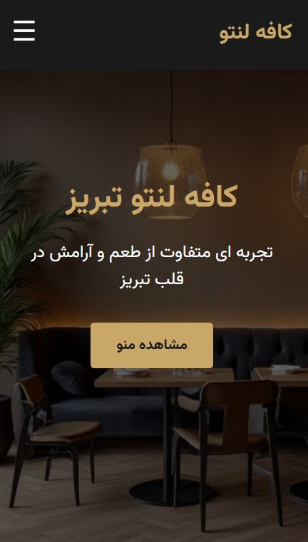
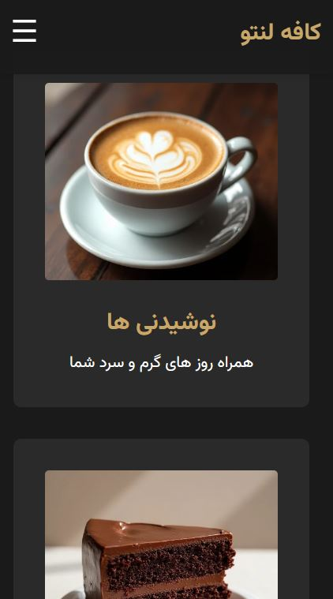
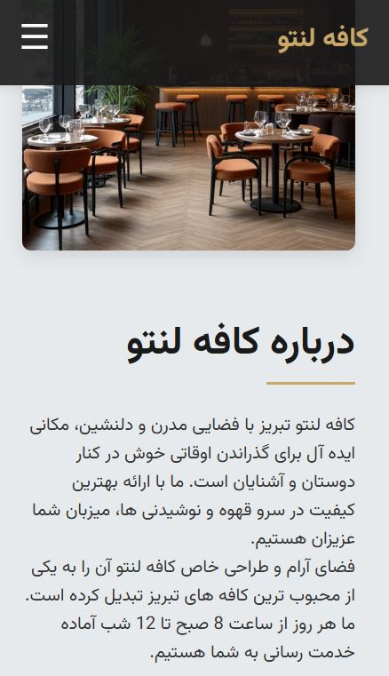
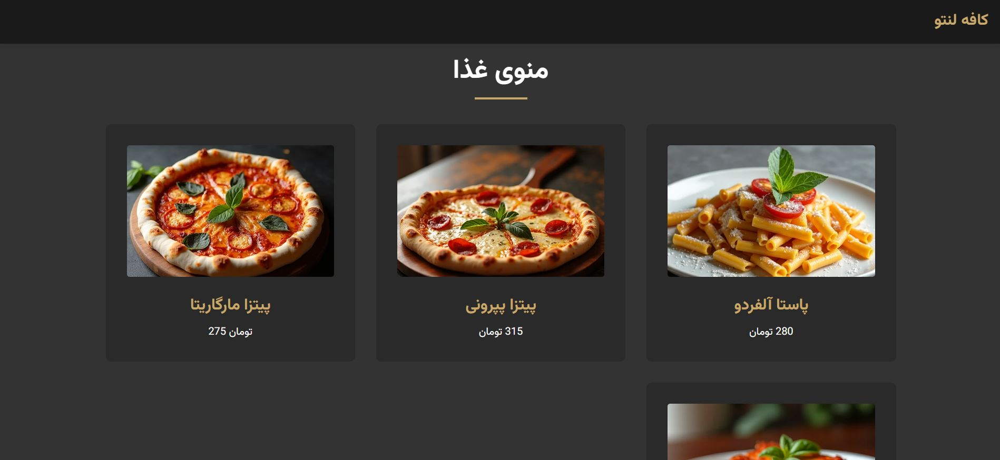

# 🍰 منوی کافه لنتو 

یک وبسایت ساده و سبک برای نمایش منوی نوشیدنی‌ها، کیک‌ها و غذاهای کافه لنتو (یک کافه خیالی)✨

## ✨ ویژگی‌ها

- طراحی واکنش‌گرا (Responsive) برای موبایل و دسکتاپ 📱💻
- هدر با منوی همبرگری در نسخه موبایل 🍔
- کد ساده با HTML, CSS, JavaScript - بدون فریم‌ورک 🚫🔧
- چند صفحه جداگانه برای نوشیدنی، کیک و غذاها 🧁☕🍕

## 🖼️ پیش‌نمایش

## 📌 نکته

این پروژه صرفاً یک تمرین یک‌روزه بود و بیشتر برای تفریح ساخته شده ✌️  
و یه نکته جالب دیگه: تمام تصاویر داخل پروژه با کمک هوش مصنوعی رافائل ساخته شدن! ✨

